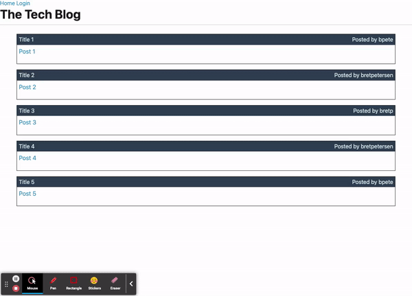

# MVC-tech-blog

Homework #12 - MVC Tech Blog

## what did I do?

This assignment required making a tech blog where a User can sign up, login, create posts, and comment on posts. The User can also delete their posts and comments. There is a dashboard the User can access to see posts of their own.

## what do I need to explain

This project is not completed yet.

## animated GIF walk through

[]
